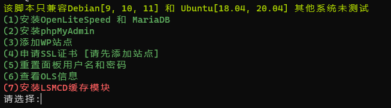

# OpenLiteSpeed Tools [自用工具] 
需要使用全新的VPS
### 面板操作

```Shell
wget https://raw.githubusercontent.com/pofoy-com/wtools2/olstool/ools.sh
bash ools.sh
```

### 站点备份

```Shell
wget https://raw.githubusercontent.com/pofoy-com/wtools2/olstool/obackup.sh
bash obackup.sh www.SiteDomain.com
```
